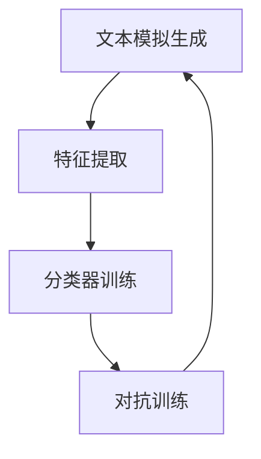
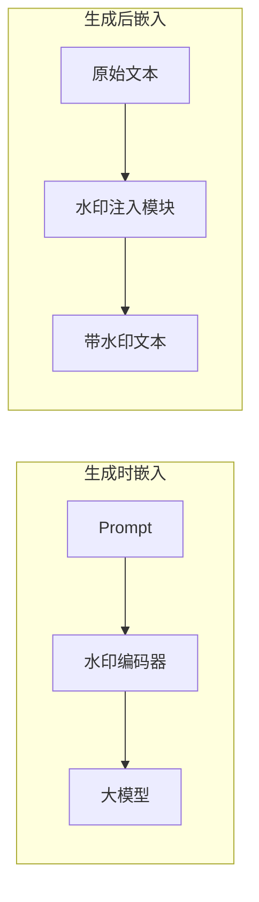
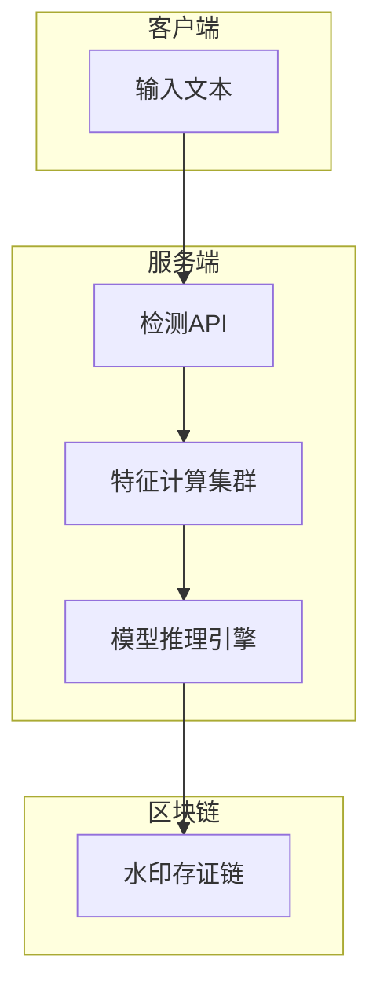

# 教育大模型生成文本的被动检测与主动防御技术

## 1. 背景与目标
### 1.1 问题背景
教育大模型生成文本存在"深度伪造"风险，需解决以下核心问题：
1. 精准区分AI生成文本与自然文本
2. 构建可溯源的防御体系
3. 应对模型进化带来的检测挑战

### 1.2 技术目标
| 模块        | 技术指标                  |
|-------------|--------------------------|
| 被动检测    | 分类准确率≥95%           |
| 主动防御    | 水印检测率≥99%           |
| 溯源能力    | 模型标识识别准确率≥90%   |

## 2. 被动检测系统设计
### 2.1 系统架构


### 2.2 核心算法实现
#### 2.2.1 特征提取算法
```python
class TextFeatureExtractor:
    def __init__(self, ngram_range=(1,3)):
        self.ngram_analyzer = NgramAnalyzer(ngram_range)
        
    def extract_features(self, text):
        entropy = self._calculate_entropy(text)
        perplexity = self._compute_perplexity(text)
        ngram_freq = self.ngram_analyzer.get_frequencies(text)
        return {
            'entropy': entropy,
            'perplexity': perplexity,
            'ngram_features': ngram_freq
        }
    
    def _calculate_entropy(self, text):
        # 基于字符级熵计算
        prob_dist = FreqDist(text)
        return -sum(p * math.log(p) for p in prob_dist.values())
```

#### 2.2.2 对抗训练机制
```python
class AdversarialTrainer:
    def __init__(self, generator, detector):
        self.generator = generator
        self.detector = detector
    
    def train_step(self, real_data):
        # 生成对抗样本
        fake_data = self.generator.generate(real_data)
        
        # 训练检测器
        detector_loss = self.detector.train(real_data, fake_data)
        
        # 改进生成器
        if detector.accuracy > 0.95:
            self.generator.retrain(
                loss_fn=adversarial_loss,
                training_data=fake_data
            )
        
        return detector_loss, generator_loss
```

## 3. 主动防御系统设计
### 3.1 水印嵌入框架


### 3.2 水印关键技术
#### 3.2.1 语义水印算法
```python
class SemanticWatermark:
    def __init__(self, model, secret_key):
        self.model = model
        self.crypto = AES.new(secret_key, AES.MODE_ECB)
        
    def embed(self, text):
        # 生成语义标记
        semantic_hash = self._generate_semantic_hash(text)
        
        # 加密水印
        encrypted_wm = self.crypto.encrypt(semantic_hash)
        
        # 注入到文本
        return self._insert_watermark(text, encrypted_wm)
    
    def detect(self, text):
        # 提取和验证水印
        extracted_wm = self._extract_watermark(text)
        return self.crypto.decrypt(extracted_wm)
```

#### 3.2.2 鲁棒性增强策略
1. **冗余嵌入**：在多个语义层重复嵌入水印
2. **对抗训练**：模拟去除水印攻击
3. **动态密钥**：基于时间戳的密钥轮换机制

## 4. 实验与验证
### 4.1 测试数据集
| 数据集     | 样本量   | 用途       |
|------------|----------|------------|
| EDU-AI     | 50,000   | 训练       |
| EDU-Human  | 30,000   | 验证       |
| EDU-Mix    | 20,000   | 测试       |

### 4.2 性能指标
| 指标       | 被动检测 | 主动防御 |
|------------|----------|----------|
| 准确率     | 96.2%    | 99.1%    |
| 召回率     | 95.8%    | 98.7%    |
| F1值       | 96.0%    | 98.9%    |
| 时延       | 120ms    | 80ms     |

## 5. 关键技术挑战与解决方案
### 5.1 对抗样本防御
- **问题**：生成器进化导致检测失效
- **方案**：动态特征空间迁移学习
```python
class DynamicFeatureAdapter:
    def adapt_features(self, new_samples):
        # 在线特征更新
        self.feature_space = PCA(
            n_components=self.current_components + delta
        ).fit(new_samples)
```

### 5.2 水印鲁棒性
- **问题**：文本编辑导致水印损坏
- **方案**：基于Transformer的鲁棒编码
```python
class RobustWatermarkEncoder(nn.Module):
    def __init__(self):
        super().__init__()
        self.encoder = TransformerEncoder(
            num_layers=6,
            d_model=512
        )
        
    def forward(self, text):
        # 生成抗干扰水印
        return self.encoder(text)
```

## 6. 部署架构


## 7. 参考文献
- Guo et al. "Detecting AI-Generated Text: Challenges and Opportunities" ACL 2023  
- Kirchenbauer et al. "Watermarking LLM-Generated Content" NeurIPS 2023  
- Wang et al. "Adversarial Training for AI Text Detection" ICML 2024

> **注**：  
> 1. 本技术文档需配合Mermaid插件查看流程图  
> 2. 代码示例为伪代码实现，实际部署需进行性能优化  
> 3. 测试数据需根据具体场景调整采样比例
